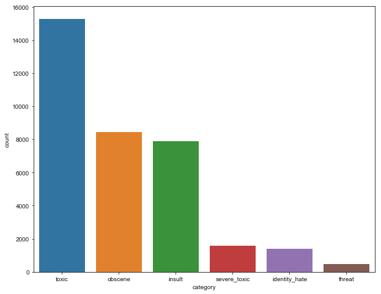

# Machine Learning Engineer Nanodegree
## Capstone Proposal
Anvesh Tummala  
April 9th, 2018

## Toxic Comment Classification  

###### Identify and classify toxic online comments

-----------
### Motivation:

Cyber bullying and online harassment is making many lives miserable. Can we control this problem?

I would like to share my recent online experience.
> Couple of weeks back I was watching Badminton match on youtube live streaming. That was a very competitive game, both sides are supporting their players very strong. I started looking into the live chat, some one started texting racial and abusive comments on a player, that leads to a long hated conversation among some extreme supporters. This experience made me to leave the discussion.

### Domain Background

Every individual voice matters a lot for a community to get the diverse opinions and feedbacks. But with increasing number of online threats, hate conversations, sexual abusive comments many people stop expressing themselves. This is a great threat to free voice.

Like youtube live chat, many platforms struggle to effectively facilitate conversations, leading many communities to limit or completely shut down user comments.  

For solving this problem we will be using the data of Wiki comments included in [*Toxic Comment Classification Challenge*](https://www.kaggle.com/c/jigsaw-toxic-comment-classification-challenge) from Kaggle.

Here is an interesting work by Jigsaw ad WikiMedia Foundation: [Ex Machina: Personal Attacks Seen at Scale](https://arxiv.org/pdf/1610.08914.pdf). As this paper also uses the Wiki comment dataset, it will be greatly helpful to know the bias in the data, challenges in data preprocessing. This paper will also be helping in benchmarking the results of our project.

Solving this problem will have great social cause. This problem gives a great scope to explore NLP and Deep learning concepts though this journey.

### Problem Statement

The goal of this project is to create a multi-headed model that is able to detect probability of different levels of toxicity like threats, obscenity, insults, and identity-based hate on any textual data(comments/posts). This model will helps online communities to create a better monitoring, in-turn creates a better place for productive and respectful conversations. For model creation we will be exploring a lot of Deep learning models and we will have great understanding of performance comparison for text classification.

Traditionally identifying the toxic comments is worked as a binary classification problem where they just try to make 2 labels (toxic, non-toxic) more like a sentiment analysis model. Whereas in this project we will be trying to do a multi-labeled classification, that can be able to identify the nature of toxicity (threats, obscenity, insults, identity-based hate). So this is a classification problem that takes the input training dataset of wiki comments that were hand labeled to different toxic classes and we will train a model. Finally we will test the model that takes the test comments and will try to label toxicity in them. I will also try to train ensemble of binary classification models with each class labels as true or false and compare it with single model.

### Datasets and Inputs

As part of Kaggle's Toxic Comment Classification Challenge, Jigsaw and Google together provided a dataset of comments from Wikipedia’s talk page edits. These comments have been labeled by human raters for the following toxic types "toxic, severe_toxic, obscene, threat, insult, identity_hate".

The dataset includes:
* train.csv - the training set, contains 159571 wiki comments with their binary labels
* test.csv - the test set, you must predict the toxicity probabilities for 153164 comments. To deter hand labeling, the test set contains some comments which are not included in scoring.

From the training dataset, we will be feature engineering and will be considering the features like number of words, parts of speech, number of punctuations, number of upper case words, etc

Here is the list of toxic labels and their distribution out of 159571 training samples. From the below diagram the classes are not balanced, so we need to use sampling techniques to overcome this.

 We will be using 60/15/25 % slit on training data to get train/validation/testing(as they haven't given labeled testing data). We will also try to use the k-fold split to gain the more training data. In the split data sets I will be verifying the distribution of output labels, as that is very crucial for out testing score.  

-----------
1. [Kaggle, Jigsaw-toxic-comment-classification-challenge-data](https://www.kaggle.com/c/jigsaw-toxic-comment-classification-challenge/data)

### Solution Statement

The plan of action to solve this problem involves:

* Downloading and analysis the input test data.
* Data Preprocessing - fill nulls, clean the comments, dimension reduction, etc  
* Using bag_of_words/Glove/WordToVec to encode the comment into a vector representation.
* Data Analysis and Feature Engineer to add or delete some features related to the problem domain.
* Splitting the training data into train and validation sets.
* Creating different Deep Learning models (LSTM, RNN, CNN)and comparing their accuracy.  
* Doing parameter tuning to yield better accuracy scores.

### Benchmark Model

The basic Benchmark model will be using Logistic Regression model on the test representation of using TF-IDF (Term Frequency, Inverse Document Frequency), which will be a term document matrix. It would be nice to see how the Deep Learning Models will better perform over this basic benchmark model.

### Evaluation Metrics

I will be using the evaluation metric as the mean column-wise ROC AUC. It is the average score of individual AUCs of each predicted column.

The possible outcomes of a classification are true positive (TP), false positive (FP), true negative (TN), false negative (FN).

* true positive rate: TPR = positives correctly classified / total positives = TP / P
* alse positive rate: FPR = negatives incorrectly classified / total negatives = FP / N

ROC is a graph over FPR (False positive rate) over X-axis and TPR(True positive rate) over Y-axis.

This metric would  a great measure of probabilistic classification among different labels. We will consider each column AUC separately and will average it for our final score.   

### Project Design

The primary strategy of this project is to compare different model implementations ranging from Machine Learning Models like
* Logistic Regression
* SVM
* LightGBM
* XGBoost

and deep learning models like

* GRU
* LSTM
* CNN
* RNN
* Capsule net
* other models

over different representations of comments like

* word2vec (skip-gram)
* word2vec - continuous bag of words(CBOW)
* Window based co-occurrence matrix
* Low dimensional vector - (SVD)
* Glove

In this process the input representation matters a lot, the following pre-processing techniques will be considered.

Pre processing:
* Capitalization - case insensitivity
* Removing stop words - least useful words like 'the', 'and' will be removed
* Tokenization - creating separate tokens
* Part of speech tagging - to know meaning of word/sentence better
* Stemming - to reduce the input corpus. Prefer Lemmatization over stemming
* Lemmatization - to reduce the input corpus. It uses dictionary lookup, context of sentence, part of speech.

Feature Engineering techniques:
* Part of Speech - this would be a great feature in the case of classification as identity threat might consider more nouns. we can also consider the count of different parts of speech as a feature.
* We can also try to use Proportion of capitals, Number of unique words, Number of exclamation marks, Number of punctuations, number of emojis, etc

We will use PCA (Principle component analysis to extract the most valued components for our problem). This will help in better training by using more relevant feature combinations.

We will be leveraging Google Compute Service for GPU enabled instances for this project to run these DNN models faster.

This project will be a great exploratory project for different NLP model implementations and comparing their accuracy, time of execution, etc

-----------
1. [GPU setup instruction](https://github.com/atmc9/GPU-cloud-setup)
2. [NLP with deep learning by Stanford](https://www.youtube.com/watch?v=OQQ-W_63UgQ&list=PL3FW7Lu3i5Jsnh1rnUwq_TcylNr7EkRe6)
3. [Public kernels from Kaggle Competition](https://www.kaggle.com/c/jigsaw-toxic-comment-classification-challenge/kernels)
